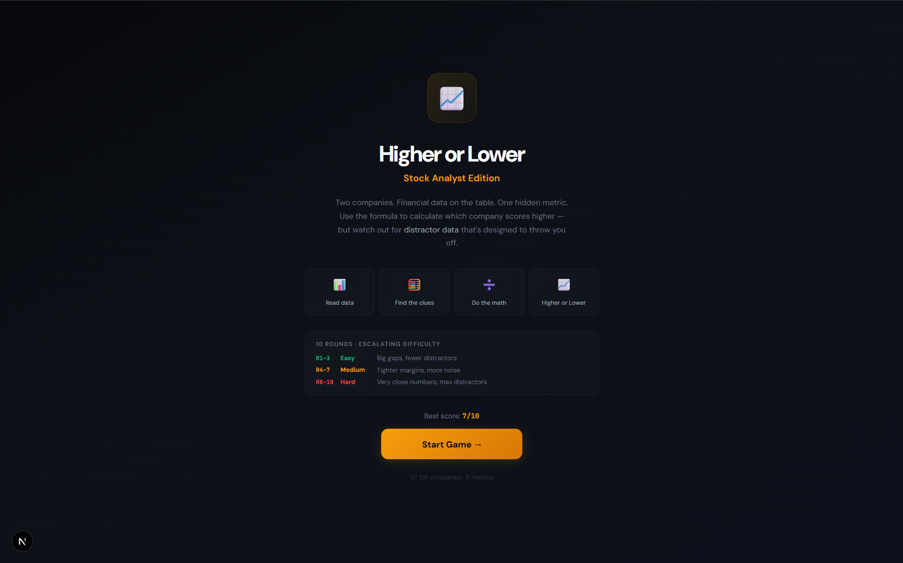
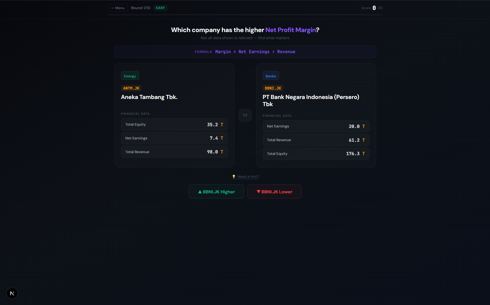

# Stock Higher/Lower - Analyst Edition

An interactive financial analysis game that tests your understanding of key stock metrics using real Indonesian Stock Exchange (IDX) data.





## 🎮 Quick Start

```bash
git clone https://github.com/yourusername/stock-higher-lower-game
cd stock-higher-lower-game
npm install
npm run dev
```

Open http://localhost:3000 and start playing!

## What It Does

Test your financial analysis skills across 10 rounds of increasing difficulty:

- **5 Key Metrics**: ROE, ROA, P/E, P/B, Net Profit Margin
- **Real Companies**: Banks, telecoms, consumer goods, energy, and more
- **Escalating Difficulty**:
  - Easy (Rounds 1-3): Big differences, fewer distractors
  - Medium (Rounds 4-7): Tighter margins, more noise
  - Hard (Rounds 8-10): Very close numbers, maximum distractors
- **Educational Insights**: Learn why one company scores higher after each round
- **Distractor Data**: Not all data shown is relevant - can you find what matters?

Think "Higher or Lower" card game, but for financial analysis.

## How to Play

1. You see financial data for two companies
2. You see a formula for a metric (e.g., ROE = Earnings ÷ Equity)
3. **Challenge**: Figure out which company has the higher value
4. Watch out - some data fields are distractors!

### Example Round

```
Question: Which company has higher Return on Equity (ROE)?
Formula: ROE = Net Earnings ÷ Total Equity

Company A (BBCA):
- Net Earnings: 57,537B IDR
- Total Revenue: 112,006B IDR      ← Distractor!
- Total Equity: 281,688B IDR
- Total Assets: 1,586,830B IDR     ← Distractor!

Company B (BBRI):
- Net Earnings: 57,158B IDR
- Total Revenue: 200,081B IDR      ← Distractor!
- Total Equity: 337,898B IDR
- Total Assets: 2,123,447B IDR     ← Distractor!

Answer: Company A (20.4% vs 16.9%)
```

## Project Structure

```
├── app/
│   ├── components/
│   │   └── StockGame.jsx       # Main game component
│   ├── layout.js
│   └── page.js                 # Loads data from JSON
├── public/data/
│   └── companies.json          # Stock data goes here
├── package.json
└── README.md
```

## Using Your Own Data

The game reads company data from **`public/data/companies.json`**.

To use fresh data or different companies:
1. Replace `public/data/companies.json` with your own data
2. Reload the page

**Want to learn how to fetch real-time Indonesian stock data using AI?**
👉 Check out the [Sectors MCP Guide](link-to-your-guide) to see how this data was generated in 30 seconds.

### Data Format

The JSON file should be an array of company objects with these fields:

```json
[
  {
    "ticker": "BBCA",
    "name": "Bank Central Asia",
    "sector": "Banks",
    "pe": 15.32,
    "roe": 0.2043,
    "roa": 0.0363,
    "pb": 3.13,
    "profitMargin": 0.5137,
    "market_cap": 881756,
    "total_assets": 1586830,
    "total_equity": 281688,
    "total_liabilities": 1305140,
    "revenue": 112006,
    "earnings": 57537,
    "der": 0.0085
  }
]
```

**Note**: Percentage fields (roe, roa, profitMargin) should be decimals (e.g., 0.2043 = 20.43%)

## Metrics Explained

- **ROE (Return on Equity)**: How efficiently a company uses shareholder equity
- **ROA (Return on Assets)**: How efficiently a company uses its assets
- **P/E (Price-to-Earnings)**: What investors pay per rupiah of earnings
- **P/B (Price-to-Book)**: Market value vs book value of equity
- **Net Profit Margin**: How much of each revenue rupiah becomes profit

## Tech Stack

- **Next.js 15** (App Router)
- **React 19**
- **Pure CSS** (no external libraries)

## Deployment

```bash
npm run build
npm start
```

## What You Can Build

Inspired? Here are more ideas for financial games and tools:
- 📊 Portfolio trackers
- 🔍 Stock screeners
- 📈 Sector dashboards
- 🚨 Value alerts
- 📚 Financial education tools

## Contributing

Found a bug? Want to add features?

1. Fork the repo
2. Create a feature branch
3. Make your changes
4. Submit a PR

Ideas for contributions:
- Add more metrics (EPS growth, dividend yield, etc.)
- Add difficulty settings
- Add leaderboards
- Add multiplayer mode

## Credits

- **Built with**: Next.js + React
- **Fonts**: DM Sans, JetBrains Mono (Google Fonts)
- **Data**: Indonesian stock data from [Sectors](https://sectors.app)

## Acknowledgements

This project was developed with the help of Claude AI on code implementation, UI enhancement, and especially debugging.

---

**A demonstration of what you can build when getting data is easy.**
